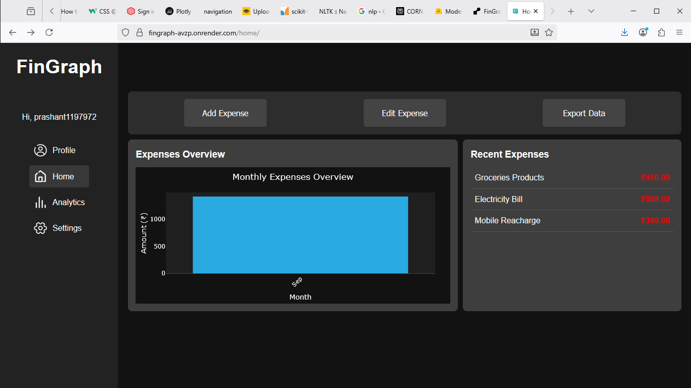
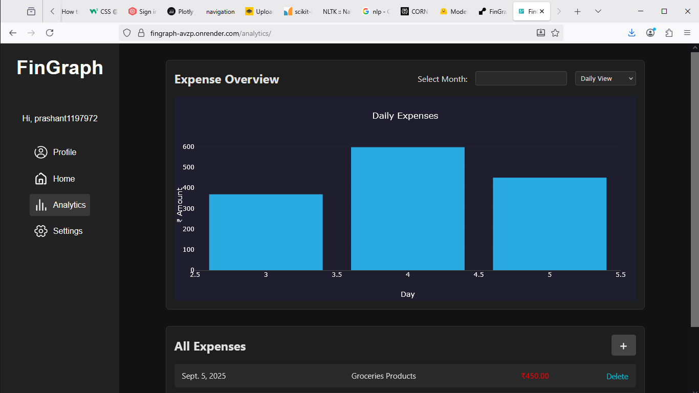
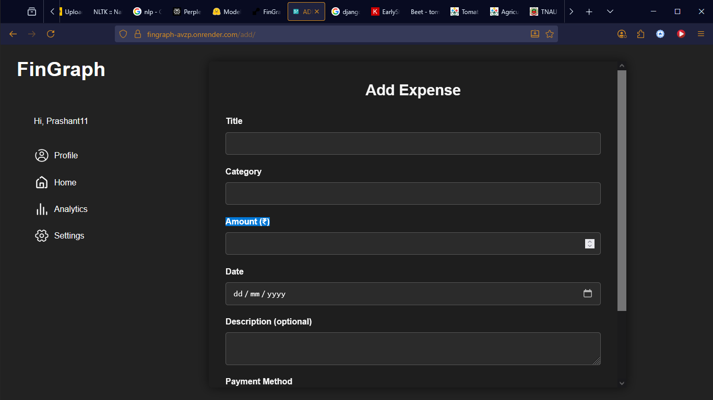
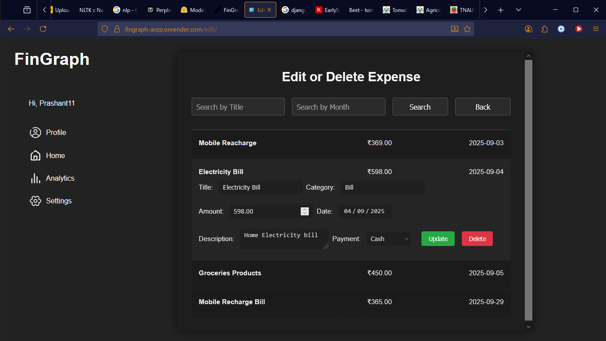

# FinGraph - Expense Tracker

A Django-based web application for visualizing financial data using interactive charts. Users can analyze and track financial trends through a simple interface.

## Features
- Add, update, delete expenses
- User-friendly dashboard for financial data
- Filter by month/year/daily view
- Graphs powered by Plotly
- Export to CSV or PDF
- Secure user login/logout

## Tech Stack
- Backend: Django (Python)
- Frontend: HTML, CSS, JavaScript
- Database: SQLite / PostgreSQL

## Live Demo
🔗 https://fingraph-avzp.onrender.com

## Screenshots
1. Dashboard

2. Analytic

3. Add Expenses 

4. Edit Expenses


## Setup Instructions
```bash
1. Clone the repo:

    git clone https://github.com/Prash3464/fingraph.git
    cd fingraph

2. Create virtual environment:
    python -m venv venv
    source venv/bin/activate   # Windows: venv\Scripts\activate
 
3. Install dependencies: `pip install -r requirements.txt`
4. Run migrations: `python manage.py migrate`
5. Run server: `python manage.py runserver`
6. Open in browser: `http://127.0.0.1:8000/`
   ```

## Future Improvements
- Add 2FA Authentication system
- Improve UI/UX
- Deploy with persistent database
- Budget alerts

## Author
**Prashant Pal**  
GitHub: https://github.com/Prash3464
